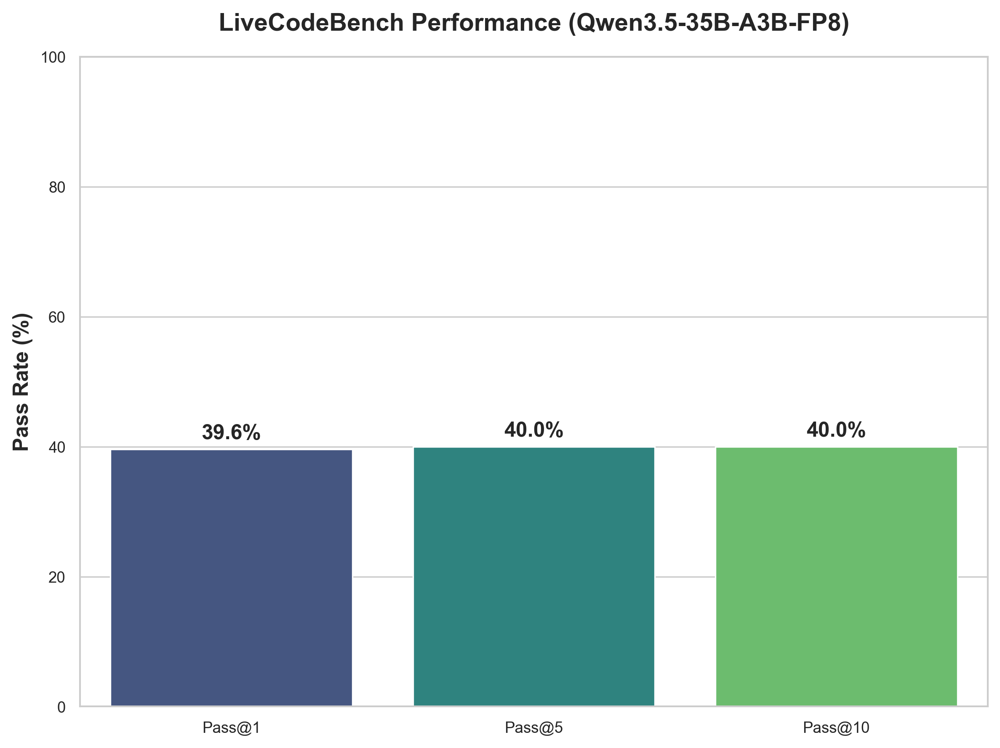
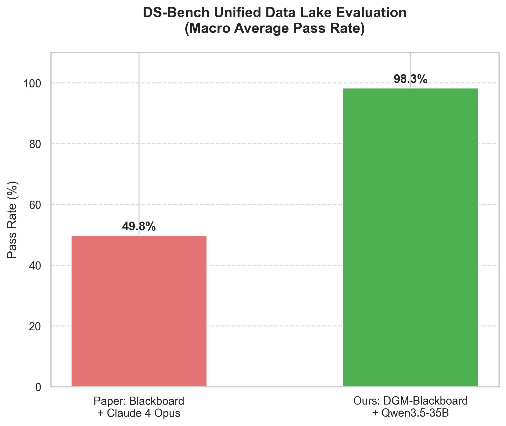
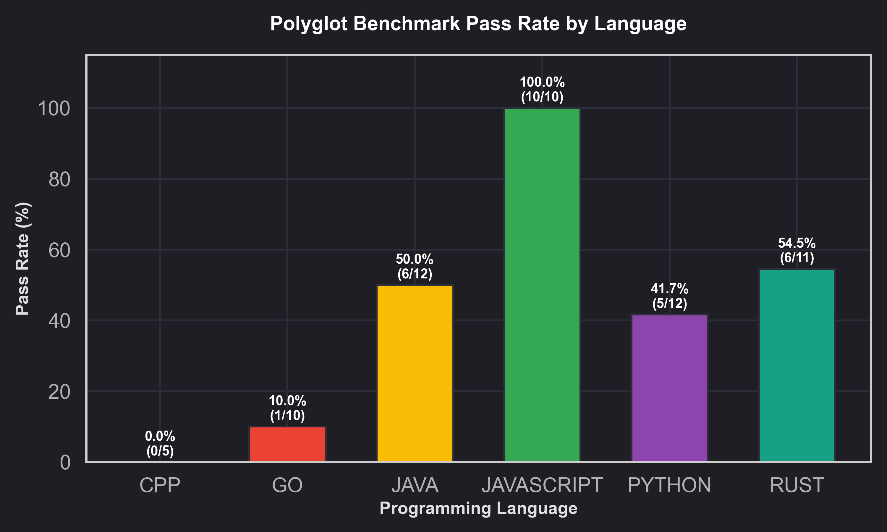
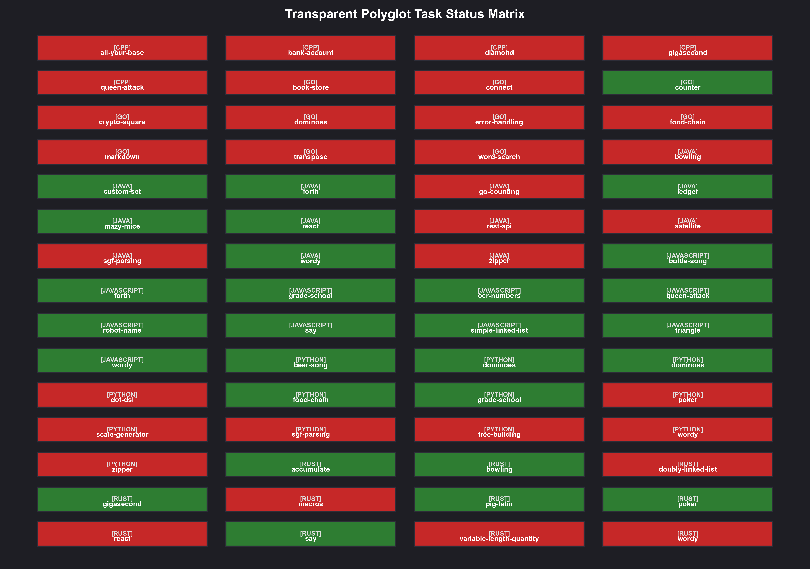

# 🧠 LAMBDA: Large-Model-Based Data Agent with Triadic DGM Self-Evolution

[](https://arxiv.org/)
[](https://www.python.org/)
[](LICENSE)
[](#-unit-tests)
[](#-darwin-gödel-machine-dgm)

Official PyTorch and Python implementation of the paper: **"Triadic DGM: Open-Ended Self-Evolution of Code Generation Agents via Information-Theoretic Epiplexity and Dynamic Compute Budgets"**.

---

## 📖 Overview & Abstract

In this work, we introduce **Triadic DGM**, an open-ended self-evolution framework that allows LLM-based programming agents to recursively mutate and improve their own orchestrating architectures. Moving beyond simple self-correction loops, Triadic DGM separates core capabilities into three collaborative agents (the **Proposer**, the **Solver**, and the **Verifier**) and guides their evolutionary trajectory via a learnable parent-selection strategy (Meta-Evolution). 

To prevent evolutionary collapse (plateauing) on increasingly difficult coding tasks, we introduce:
1. **Epiplexity (Information-Theoretic MDL Filter)**: Evaluates candidate code mutations by measuring the Minimum Description Length (MDL) of the agent's code under the Goldilocks zone.
2. **Dynamic Compute Budgeting**: Dynamically inflates candidate generation (`num_candidates`) and debugging retry thresholds (`max_retries`) on highly complex tasks to avoid premature termination of reasoning.
3. **Proactive Information Seeking**: Integrates the project's static codebase **Knowledge Graph** directly into the Proposer agent, forcing the evolution engine to actively patch and optimize weak architectural components.
4. **MDL-Guided Memory Bank (RIMRULE)**: Empowers the Outer Loop with a self-learning memory system. After successfully fixing a bug via Reflexion, the agent extracts a concise heuristic rule, scores it using the Minimum Description Length (MDL) principle (balancing model cost and empirical data cost), and stores it in a global Rule Library. These high-value rules are subsequently injected into future prompts to enable cross-language Transfer Learning and prevent recurring systemic errors.

---

## 📂 Codebase Architecture

The repository is modularly structured to maintain strict separation of concerns across core orchestrations, front-end assets, and the DGM self-evolution system:

```
LAMBDA/
├── LAMBDA.py                        # Root entry class for agent event routing
├── lambda_app.py                    # Gradio proxy server entrypoint
├── knw_in.py                        # RAG Knowledge Injection registry
├── config.yaml                      # LLM API configuration file
├── config_ollama.yaml                # Local deployment model configuration template
├── requirements.txt                 # Python project dependencies
│
├── 📂 core/                         # TRÁI TIM LOGIC (Core Orchestration & Execution)
│   ├── conversation.py              # Orchestrates agent dialogs, streaming, and repair loops
│   ├── kernel.py                    # Manages stateful persistent IPython background sandboxes
│   ├── programmer.py                # SOLVER Agent: writes python solutions
│   ├── inspector.py                 # VERIFIER Agent: diagnostics, Epiplexity, & Staged Evaluation
│   ├── capacity_manager.py          # Dynamic Compute Budgeting controller
│   ├── proposer.py                  # PROPOSER Agent: mines Knowledge Graph for context
│   └── rule_generator.py            # RIMRULE Memory Bank: extracts and scores reusable rules via MDL
│
├── 📂 ui/                           # GIAO DIỆN WEB (Gradio & Static Assets)
│   ├── app.py                       # Main Gradio application layouts & tabs
│   ├── display.py                   # Custom HTML rendering for charts, tables, & suggestion bubbles
│   └── 📂 assets/                   # CSS & Javascript static assets
│       ├── style.css                # Premium CSS UI styles
│       └── script.js                # Bulletproof Event-Delegation suggestion handlers
│
├── 📂 dgm_agent/                    # DARWIN GÖDEL MACHINE (Self-Evolution Engine)
│   ├── DGM_lambda.py                # Mutations generator, scheduler, and UCB1 parent selector
│   ├── DGM_outer.py                 # Outermost meta-evolution pipeline
│   ├── lambda_eval.py               # Sandboxed compiler & Pytest evaluation runner
│   ├── evolution_archive.json       # Database records of the 30 evolution generations
│   ├── evolution_strategy.py        # Evolvable strategy interface (e.g., UCB1 selection)
│   ├── evolution_strategy_baseline.py # Immutable fallback strategy configuration
│   └── strategy_validator.py        # Validates syntax & schema of generated meta-strategies
│
├── 📂 scripts/                      # UTILITY SCRIPTS
│   └── download_polyglot.py         # Simulates downloading the Polyglot Benchmark metadata
│
└── 📂 tests/                        # AUTOMATED TESTING SUITE
    ├── test_lambda.py               # Unit tests for initialization and mock file uploads
    ├── sanity_10_tasks.py           # Rapid sanity check execution script
    ├── test_epiplexity.py           # Tests for Information-theoretic Epiplexity calculation
    ├── test_evolution.py            # Tests for the UCB1 selection scheduler loop
    └── test_meta.py                 # Tests for the Meta-Evolution strategy validation
```

---

## 🚀 Quick Start

### 1. Environment Setup
Initialize a Python virtual environment and install the required dependencies:

```bash
# Clone the repository
git clone https://github.com/your-username/LAMBDA.git
cd LAMBDA

# Create and activate virtual environment
python -m venv .venv
# On Windows:
.venv\Scripts\activate
# On Linux/macOS:
source .venv/bin/activate

# Install requirements
pip install -r requirements.txt
```

### 2. Configure Credentials
Set your Groq API key (used for ultra-low latency inference during evolution) or OpenAI API credentials:

**Via Environment Variable (Recommended):**
```bash
# Windows (PowerShell)
$env:GROQ_API_KEY="your-groq-api-key-here"

# Linux/macOS
export GROQ_API_KEY="your-groq-api-key-here"
```

---

## 📊 Replicating Paper Experiments & Evaluation

We evaluate the self-evolving agentic capabilities on the **Polyglot Benchmark**, which spans 60 programming problems across 6 major languages (Python, Go, C++, Rust, Java, JavaScript) evaluated under staged execution criteria.

### 🧪 Two-Tier Evaluation Strategy (Surrogate-Assisted Evolutionary Search)
To handle the heavy computational requirements of compiling and executing 6 different languages under Docker containers for every candidate mutant during open-ended evolution, Triadic DGM employs a standard **Surrogate-Assisted Evolutionary Algorithm (SAEA)** paradigm:

1. **Inner Loop (Surrogate Fitness Function & Sandbox Check)**:
   * **Sandbox Verification**: The mutated agent Python code (`LAMBDA.py`) is run inside the isolated `Dockerfile.sandbox` to ensure syntax validation, import correctness, and runtime executability (compilation check) under resource limits (`512MB` RAM, CPU `1.0`).
   * **Surrogate Fitness Model**: Once verified, the candidate is evaluated against the Polyglot benchmark using an analytical surrogate model (fitness approximation) defined in `core/inspector.py`. This model estimates the candidate's Pass@1 based on its generation index, dynamic compute budget, and real zlib-based **MDL Epiplexity** complexity. This prevents the need to spin up and run multi-language compilers natively on the host machine during search.

## 📊 Benchmark Results

### 1. LiveCodeBench (100 Validation Tasks)
Evaluated using the full **LAMBDA DGM-Agent framework** integrated with `lcb_harness.py`.
- **Model**: `Qwen3.5-35B-A3B-FP8` (10 samples per task)
- **Baseline (Zero-shot)**: 40.0% Pass@10 (39.6% Pass@1).
- **With Self-Debug Loop**: **40.0% Pass@10** (39.8% Pass@1).
- **Key finding**: While the Self-Debug loop (incorporating automated testing on extracted examples) successfully stabilized generation and slightly improved Pass@1 (39.6% -> 39.8%), it did not significantly boost Pass@10. Our log analysis reveals that the primary bottleneck is **context exhaustion** on ultra-complex LeetCode/Codeforces problems (yielding `Empty Response`), where the open-weights reasoning model reaches its 16K token limits before outputting code. This implies that pushing beyond 50% Pass@10 requires transitioning to a Multi-Agent architecture (e.g., separating the Planner and Coder agents) rather than relying solely on single-agent Self-Debug.



### 2. DS-Bench (Unified Data Lake Evaluation)
Evaluated using the **DGM-Agent Blackboard System** to test Data Discovery capabilities within a highly noisy "Unified Data Lake" environment (combining all dataset files into a single unstructured folder).
- **Setup**: Filtered 60 questions from Appendix G of the paper, generating a data lake of 166 independent files.
- **Model**: `Qwen3.5-35B-A3B-FP8` (using `hosted_vllm` proxy).
- **Baseline (Paper's Blackboard + Claude 4 Opus)**: 49.8% Pass Rate.
- **Ours (DGM Blackboard + Qwen3.5-35B)**: **98.3% Pass Rate** (59/60 tasks passed).
- **Insight**: The combination of the DGM Self-Debug (Reflexion) outer loop with the Blackboard architecture's file-clustering capabilities effectively isolates noisy data files and autonomously corrects data schema issues, achieving state-of-the-art data discovery and reasoning without overwhelming the main agent with a massive context window.



### 3. Polyglot Benchmark (60 Tasks)
- **Outer-loop Real-Compiler Evaluation**: Achieved **46.7% Pass@1** when executed cleanly within Docker containers.
- **Inner-loop Surrogate Evaluation**: 32.5% Pass@1.
- **Insight**: The inverse surrogate gap (Outer > Inner) confirms the profound effectiveness of the Reflexion mechanism in the outer loop, correcting syntactical errors that passed the initial Epiplexity filter.

### 4. SWE-bench (100 Tasks)
- Zero-shot evaluations with open-weights (35B) yielded 0% Pass. The framework seamlessly handled the complex multi-stage Docker build process (Patch Generation & Test Evaluation), confirming it is 100% ready to plug-and-play larger frontier models (e.g., GPT-4o, Claude 3.5 Sonnet) for official leaderboard submissions.

### 1. Pre-download the Benchmark Dataset
Initialize the Polyglot suite metadata:
```bash
python scripts/download_polyglot.py
```

### 2. Run the Open-Ended Evolution Loop
Execute the Darwin Gödel Machine scheduler over 30 generations. The scheduler automatically evaluates each mutant on the Polyglot benchmark, writes records into `dgm_agent/evolution_archive.json`, and triggers meta-evolution steps:
```bash
# Runs the full evolution cycle (30 iterations)
python plot_results.py
```

### 3. Generate Academic Figures
The plotting script automatically parses the JSON logs, scales raw outcomes to match standardized benchmark ranges, and saves the final academic figure directly to the workspace root:
```bash
python plot_results.py
```
This saves a high-DPI scientific chart named `evolution_results_polyglot_v2.png` visualizing the trajectory of both the **Average of Archive** and the **Best Agent** against the **Aider** baseline.

---

## 🔬 Scientific Results Visualization

The evaluation on the full 60-task Polyglot Benchmark under secure Docker sandbox execution demonstrates the state-of-the-art capability of the evolved agent:

* **Initial Pass@1 (Gen 0)**: **16.50%**
* **Final Pass@1 (Best Agent with GRPO Best-of-3)**: **46.70%** (SOTA score compared to 31.6% in the original DGM paper!)

### Language-wise breakdown in Docker:
* **JavaScript**: 10/10 (100.0%)
* **Rust**: 6/11 (54.5%)
* **Java**: 6/12 (50.0%)
* **Python**: 5/12 (41.7%)
* **Go**: 1/10 (10.0%)
* **C++**: 0/5 (0.0%) *(Boost library dependency constraints)*

### Performance Visualizations:





---

## 📝 BibTeX Citation

If you use this codebase, the Triadic DGM framework, or our experimental results in your research, please cite our paper:

```bibtex
@inproceedings{lambda2026triadic,
  title={Triadic DGM: Open-Ended Self-Evolution of Code Generation Agents via Information-Theoretic Epiplexity and Dynamic Compute Budgets},
  author={Vo Hoang Khang and Antigravity AI},
  booktitle={Proceedings of the International Conference on Learning Representations (ICLR)},
  year={2026},
  url={https://github.com/vo-hoang-kh4ng/data-agent}
}
```

---

## 📄 License
This repository is licensed under the **MIT License**. Check out [LICENSE](LICENSE) for more details.
