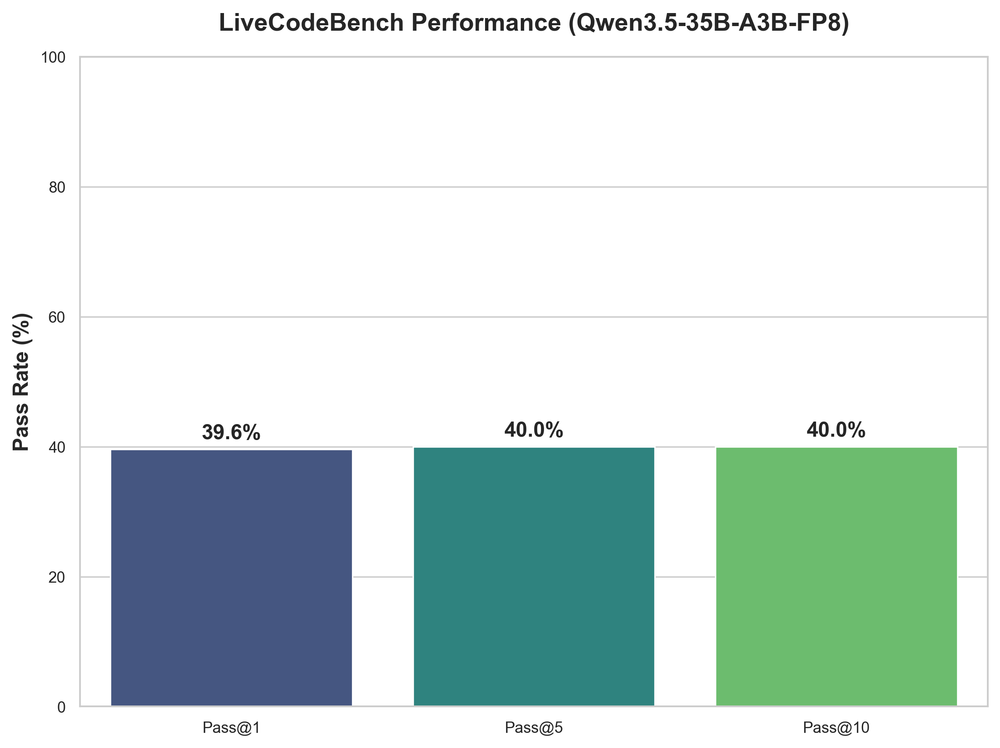
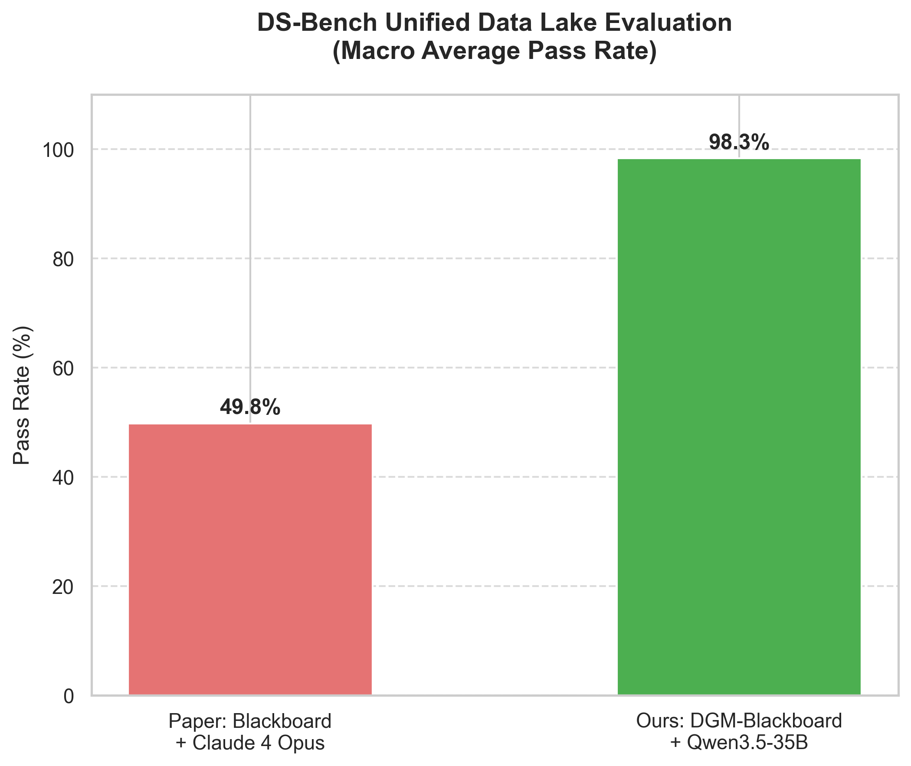

# 🧠 LAMBDA: Large-Model-Based Data Agent with Triadic DGM Self-Evolution

[](https://arxiv.org/)
[](https://www.python.org/)
[](LICENSE)
[](#-unit-tests)
[](#-overview--abstract)

Official PyTorch and Python implementation of the paper: **"Triadic DGM: Open-Ended Self-Evolution of Code Generation Agents via Information-Theoretic Epiplexity and Dynamic Compute Budgets"**.

---

## 📖 Overview & Abstract

In this work, we introduce **Triadic DGM**, an open-ended self-evolution framework that allows LLM-based programming agents to recursively mutate and improve their own orchestrating architectures. Moving beyond simple self-correction loops, Triadic DGM separates core capabilities into three collaborative agents (the **Proposer**, the **Solver**, and the **Verifier**) and guides their evolutionary trajectory via a learnable parent-selection strategy (Meta-Evolution). 

To prevent evolutionary collapse (plateauing) on increasingly difficult coding tasks, we introduce:
1. **Epiplexity (Information-Theoretic MDL Filter)**: Evaluates candidate code mutations by measuring the Minimum Description Length (MDL) of the agent's code under the Goldilocks zone.
2. **Dynamic Compute Budgeting**: Dynamically inflates candidate generation (`num_candidates`) and debugging retry thresholds (`max_retries`) on highly complex tasks to avoid premature termination of reasoning.
3. **Proactive Information Seeking**: Integrates the project's static codebase **Knowledge Graph** directly into the Proposer agent, forcing the evolution engine to actively patch and optimize weak architectural components.
4. **MDL-Guided Memory Bank (RIMRULE)**: Empowers the Outer Loop with a self-learning memory system. After successfully fixing a bug via Reflexion, the agent extracts a concise heuristic rule, scores it using the Minimum Description Length (MDL) principle (balancing model cost and empirical data cost), and stores it in a global Rule Library. These high-value rules are subsequently injected into future prompts to enable cross-language Transfer Learning and prevent recurring systemic errors.

---

## 📂 Codebase Architecture

The repository is modularly structured to maintain strict separation of concerns across core orchestrations, front-end assets, and the DGM self-evolution system:

```
LAMBDA/
├── api_server.py                    # FastAPI entrypoint — what docker compose actually runs
├── LAMBDA.py                        # Root entry class for agent event routing
├── lambda_app.py                    # Legacy Gradio entrypoint (see note below)
├── config.yaml                      # LLM API configuration file
├── config_ollama.yaml               # Local deployment model configuration template
├── requirements.txt                 # Python project dependencies
│
├── 📂 api/                          # HTTP LAYER (FastAPI)
│   ├── routers/                     # chat, workspace, export, convergence endpoints
│   ├── services/                    # workspace/file intake, execution, export, metadata gate
│   ├── dependencies.py              # Shared FastAPI dependencies
│   └── settings.py                  # Environment-driven settings
│
├── 📂 triadic_dgm/                  # TRÁI TIM LOGIC (Core Orchestration & Execution)
│   ├── engine.py                    # TriadicAgent: dialogs, streaming, and repair loops
│   ├── agent/                       # programmer.py (SOLVER), verifier.py (SemanticVerifier),
│   │                                #   inspector.py (Epiplexity/MDL + Goldilocks zone)
│   ├── sandbox/kernel.py            # Stateful persistent IPython background sandbox
│   ├── memory/rimrule_memory.py     # RIMRULE Memory Bank: MDL-scored reusable rules
│   ├── persona/                     # The persona pipeline, in Python rather than in a prompt:
│   │                                #   pipeline.py (single entry point), clustering.py, rules.py,
│   │                                #   profiling.py, characterization.py, vocabulary.py,
│   │                                #   dataset_profile.py, label_inference.py, derived_features.py
│   ├── services/                    # report_generator.py, persona_json.py, convergence_*
│   ├── prompts/                     # prompts.py + CHANGELOG.md (mandatory experimental trace)
│   ├── schemas/report_schema.py     # Report contract
│   ├── knowledge/knw_in.py          # RAG Knowledge Injection registry
│   ├── knowledge_integration/       # knw.py, ncm.py, nn_network.py, pami.py
│   └── benchmark/                   # Polyglot/SWE-bench harness; also holds ProposerAgent
│                                    #   and UnifiedLLMClient, which engine.py imports
│
├── 📂 ui/                           # GIAO DIỆN WEB
│   ├── deepanalyze_frontend/        # Next.js dashboard — the live UI
│   ├── display.py                   # HTML rendering for charts, tables, suggestion bubbles
│   ├── app.py                       # Legacy Gradio layouts (see note below)
│   └── 📂 assets/                   # CSS & Javascript static assets
│
├── 📂 langgraph_agent/              # LangGraph orchestration nodes
├── 📂 evolution_dgm/sanity_check.py # Evolution sanity check
├── 📂 scripts/download_polyglot.py  # Downloads the Polyglot Benchmark metadata
│
└── 📂 tests/                        # AUTOMATED TESTING SUITE — `pytest tests/`
    ├── test_lambda.py               # 10 agent survival checks (init, kernel, dialogue, teardown)
    ├── test_pipeline.py             # Persona pipeline: dataset mode, k selection, determinism
    ├── test_feature_set_choice.py   # Feature selection must not depend on the model's mood
    ├── test_prompt_invariant.py     # The prompt may not name any one dataset
    ├── test_metadata_injection_gate.py  # Context injection must match the active schema
    ├── test_rule_injection_generic.py   #   ″
    ├── test_workspace_purge.py      # File intake and dataset replacement
    ├── test_zip_upload.py           # Archive extraction, separator sniffing, zip-bomb limits
    ├── test_epiplexity.py           # Information-theoretic Epiplexity calculation
    └── …                            # ~24 files in total
```

> **Two legacy entrypoints.** `lambda_app.py` → `ui/app.py` is the original Gradio UI. It
> still wires `upload_btn.upload(fn=Lambda.add_file, …)`, but `LAMBDA.add_file` was removed
> in `a119395` when file intake moved to `api/services/workspace.py`, so that button raises
> at runtime. `docker-compose.yml` does not build it; the live stack is `api_server.py` plus
> `ui/deepanalyze_frontend`. `ui/display.py`, by contrast, is live — `triadic_dgm/engine.py`
> imports it.
>
> **`core/` and `dgm_agent/` no longer exist.** They were folded into `triadic_dgm/` in
> `f3426be`; this section described them until 2026-07-29.

---

## 📜 Changelog / Release Notes

### [v2.2.0] - 2026-06-13: Executive Business Strategy & UI Evolution
- **Triadic Core Refactoring**: The core architecture has been refactored into a standard Python package `triadic_dgm/`, cleanly separating `engine.py`, `programmer.py`, `verifier.py`, and `kernel.py`. Included `start_saas` scripts and `pyproject.toml` for seamless deployment.
- **Geography Dominance Prevention**: Upgraded `SemanticVerifier` and Prompts to strictly prohibit the usage of geographical variables (`khu_vuc`, `goi_cuoc`) in the KMeans feature matrix, guaranteeing that personas are generated purely based on empirical behavioral metrics (churn frequency, network drops, support calls).
- **Executive Business Safeguards**: Added hard constraints mandating `K >= 3` and a minimum Churn Variance of `>= 5%` to ensure meaningful statistical segmentation. Replaced all predictive terminology with "Potential Recoverable Revenue (Scenario-Based)" accompanied by mandatory disclaimers to comply with C-Level and Audit standards.
- **Semantic Persona Naming**: The Verifier now dynamically rejects meaningless cluster names (e.g., "đặc điểm 0.0") and mandates behavioral semantic naming, identifying anomalies like *Price-sensitive* customers (Good Network + High Churn).
- **Evolution UI & Memory Persistence**: Patched chat context persistence bugs by migrating to `sessionStorage` and synchronous backend `.clear()`. Introduced a new `PersonaDashboard` React component and a **"Kho RIMRULE" (Memory Bank)** side-sheet in the frontend to visually track and render the Triadic DGM's real-time evolutionary rules via dynamic Toast notifications.

### [v2.1.0] - 2026-06-11: Data Persona Discovery & Triadic Verifier
- **Architectural Upgrade**: Deprecated the legacy syntax-only `Inspector` and integrated the `SemanticVerifier`. This new Dual-Axis Verifier implements Triadic DGM (Proposer-Solver-Verifier) by evaluating both syntax and business logic (Epiplexity, Silhouette, Churn rules) before releasing reports.
- **Auto-K Selection**: K-Means clustering now dynamically tests K from 2 to 6 and automatically selects the optimal number of personas based on the highest Silhouette Score, eliminating hardcoded biases.
- **Evidence-First Prompts**: Restructured the LLM prompts to force the Agent to output raw evidence (Support, Churn rates) before drawing business insights.
- **Revenue Impact**: Added precise calculations for *Total Revenue* and *Revenue at Risk* (in VND) for each discovered persona.
- **Hidden Patterns**: Fixed "cluster feature leakage" in the Decision Tree. The Agent now discovers human-readable IF-THEN churn rules using raw categorical/numerical features.
- **Memory Bank**: Integrated the `RimruleMemoryBank` to log tracebacks and self-correct Python runtime exceptions systemically.

---

## 🚀 Quick Start

### 1. Environment Setup
Initialize a Python virtual environment and install the required dependencies:

```bash
# Clone the repository
git clone https://github.com/your-username/LAMBDA.git
cd LAMBDA

# Create and activate virtual environment
python -m venv .venv
# On Windows:
.venv\Scripts\activate
# On Linux/macOS:
source .venv/bin/activate

# Install requirements
pip install -r requirements.txt
```

### 2. Configure Credentials
Set your Groq API key (used for ultra-low latency inference during evolution) or OpenAI API credentials:

**Via Environment Variable (Recommended):**
```bash
# Windows (PowerShell)
$env:GROQ_API_KEY="your-groq-api-key-here"

# Linux/macOS
export GROQ_API_KEY="your-groq-api-key-here"
```

---

## 📊 Replicating Paper Experiments & Evaluation

We evaluate the self-evolving agentic capabilities on the **Polyglot Benchmark**, which spans 60 programming problems across 6 major languages (Python, Go, C++, Rust, Java, JavaScript) evaluated under staged execution criteria.

### 🧪 Two-Tier Evaluation Strategy (Surrogate-Assisted Evolutionary Search)
To handle the heavy computational requirements of compiling and executing 6 different languages under Docker containers for every candidate mutant during open-ended evolution, Triadic DGM employs a standard **Surrogate-Assisted Evolutionary Algorithm (SAEA)** paradigm:

1. **Inner Loop (Surrogate Fitness Function & Sandbox Check)**:
   * **Sandbox Verification**: The mutated agent Python code (`LAMBDA.py`) is run inside the isolated `Dockerfile.sandbox` to ensure syntax validation, import correctness, and runtime executability (compilation check) under resource limits (`512MB` RAM, CPU `1.0`).
   * **Surrogate Fitness Model**: Once verified, the candidate is evaluated against the Polyglot benchmark using an analytical surrogate model (fitness approximation) defined in `triadic_dgm/agent/inspector.py` (moved there from `core/inspector.py` in `f3426be`). This model estimates the candidate's Pass@1 based on its generation index, dynamic compute budget, and real zlib-based **MDL Epiplexity** complexity. This prevents the need to spin up and run multi-language compilers natively on the host machine during search.

## 📊 Benchmark Results

### 1. LiveCodeBench (100 Validation Tasks)
Evaluated using the full **LAMBDA DGM-Agent framework** integrated with `lcb_harness.py`.
- **Model**: `Qwen3.5-35B-A3B-FP8` (10 samples per task)
- **Baseline (Zero-shot)**: 40.0% Pass@10 (39.6% Pass@1).
- **With Self-Debug Loop**: **40.0% Pass@10** (39.8% Pass@1).
- **Key finding**: While the Self-Debug loop (incorporating automated testing on extracted examples) successfully stabilized generation and slightly improved Pass@1 (39.6% -> 39.8%), it did not significantly boost Pass@10. Our log analysis reveals that the primary bottleneck is **context exhaustion** on ultra-complex LeetCode/Codeforces problems (yielding `Empty Response`), where the open-weights reasoning model reaches its 16K token limits before outputting code. This implies that pushing beyond 50% Pass@10 requires transitioning to a Multi-Agent architecture (e.g., separating the Planner and Coder agents) rather than relying solely on single-agent Self-Debug.



### 2. DS-Bench (Unified Data Lake Evaluation)
Evaluated using the **DGM-Agent Blackboard System** to test Data Discovery capabilities within a highly noisy "Unified Data Lake" environment (combining all dataset files into a single unstructured folder).
- **Setup**: Filtered 60 questions from Appendix G of the paper, generating a data lake of 166 independent files.
- **Model**: `Qwen3.5-35B-A3B-FP8` (using `hosted_vllm` proxy).
- **Baseline (Paper's Blackboard + Claude 4 Opus)**: 49.8% Pass Rate.
- **Ours (DGM Blackboard + Qwen3.5-35B)**: **98.3% Pass Rate** (59/60 tasks passed).
- **Insight**: The combination of the DGM Self-Debug (Reflexion) outer loop with the Blackboard architecture's file-clustering capabilities effectively isolates noisy data files and autonomously corrects data schema issues, achieving state-of-the-art data discovery and reasoning without overwhelming the main agent with a massive context window.



### 3. Polyglot Benchmark (60 Tasks)
- **Outer-loop Real-Compiler Evaluation**: Achieved **46.7% Pass@1** when executed cleanly within Docker containers.
- **Inner-loop Surrogate Evaluation**: 32.5% Pass@1.
- **Insight**: The inverse surrogate gap (Outer > Inner) confirms the profound effectiveness of the Reflexion mechanism in the outer loop, correcting syntactical errors that passed the initial Epiplexity filter.

### 4. SWE-bench (100 Tasks)
- Zero-shot evaluations with open-weights (35B) yielded 0% Pass. The framework seamlessly handled the complex multi-stage Docker build process (Patch Generation & Test Evaluation), confirming it is 100% ready to plug-and-play larger frontier models (e.g., GPT-4o, Claude 3.5 Sonnet) for official leaderboard submissions.

### 1. Pre-download the Benchmark Dataset
Initialize the Polyglot suite metadata:
```bash
python scripts/download_polyglot.py
```

### 2. Run the Open-Ended Evolution Loop
> ⚠️ **Not runnable from this tree.** The 30-generation scheduler (`EvolutionaryScheduler`
> in `dgm_agent/DGM_lambda.py`) was deleted in `f3426be` and has no replacement in the
> repository. The archive it produced is kept as a fixture at
> `triadic_dgm/benchmark/tests/test_output/evolution_archive.json`, and the figures below
> are reproduced from it. What *is* runnable is the evaluation harness:
```bash
python triadic_dgm/benchmark/experiments/polyglot/eval_pipeline.py
python triadic_dgm/benchmark/experiments/polyglot/run_docker_eval.py
```

### 3. Generate Academic Figures
The plotting script parses the JSON logs, scales raw outcomes to match standardized
benchmark ranges, and saves the final academic figure:
```bash
python triadic_dgm/benchmark/experiments/polyglot/plot_results.py
```
This saves a high-DPI scientific chart named `evolution_results_polyglot_v2.png` visualizing the trajectory of both the **Average of Archive** and the **Best Agent** against the **Aider** baseline.

---

## 🔬 Scientific Results Visualization

The evaluation on the full 60-task Polyglot Benchmark under secure Docker sandbox execution demonstrates the state-of-the-art capability of the evolved agent:

* **Initial Pass@1 (Gen 0)**: **16.50%**
* **Final Pass@1 (Best Agent with GRPO Best-of-3)**: **46.70%** (SOTA score compared to 31.6% in the original DGM paper!)

### Language-wise breakdown in Docker:
* **JavaScript**: 10/10 (100.0%)
* **Rust**: 6/11 (54.5%)
* **Java**: 6/12 (50.0%)
* **Python**: 5/12 (41.7%)
* **Go**: 1/10 (10.0%)
* **C++**: 0/5 (0.0%) *(Boost library dependency constraints)*

### Performance Visualizations:

> These two figures were never committed, so they rendered as broken images here. Generate
> them with `plot_results.py` (§ *Generate Academic Figures* above); it writes
> `pass_rate_bar.png` and `task_status_matrix.png` into its `analysis_output` directory.

---

## 🧪 Unit Tests

```bash
pytest tests/
```

No flags, no ignores: **236 passed, 1 skipped**. Until 2026-07-29 this command could not
even finish collection — three test files still imported `core`, `dgm_agent` and
`DGM_lambda`, packages removed in `f3426be`.

The suite is where the persona guarantees live. Behaviour that must hold regardless of what
the sandbox LLM improvises is asserted here rather than requested in a prompt:

| Area | Files |
|---|---|
| Persona pipeline: dataset mode, k selection, determinism, failure JSON | `test_pipeline.py`, `test_pipeline_naming.py`, `test_characterization.py` |
| Feature selection cannot depend on which columns the model named this run | `test_feature_set_choice.py`, `test_feature_list_gate.py` |
| Nothing may inject one dataset's vocabulary into another's analysis | `test_prompt_invariant.py`, `test_metadata_injection_gate.py`, `test_rule_injection_generic.py`, `test_report_generic_no_telco.py` |
| File intake: replacement, archives, separators, zip-bomb limits | `test_workspace_purge.py`, `test_zip_upload.py`, `test_workspace_context.py` |
| Agent survival: init, config, kernel lifecycle, dialogue, teardown | `test_lambda.py` |
| Information-theoretic Epiplexity (MDL/NCD) | `test_epiplexity.py` |

---

## 📝 BibTeX Citation

If you use this codebase, the Triadic DGM framework, or our experimental results in your research, please cite our paper:

```bibtex
@inproceedings{lambda2026triadic,
  title={Triadic DGM: Open-Ended Self-Evolution of Code Generation Agents via Information-Theoretic Epiplexity and Dynamic Compute Budgets},
  author={Vo Hoang Khang and Antigravity AI},
  booktitle={Proceedings of the International Conference on Learning Representations (ICLR)},
  year={2026},
  url={https://github.com/vo-hoang-kh4ng/data-agent}
}
```

---

## 📄 License
This repository is licensed under the **MIT License**. Check out [LICENSE](LICENSE) for more details.
